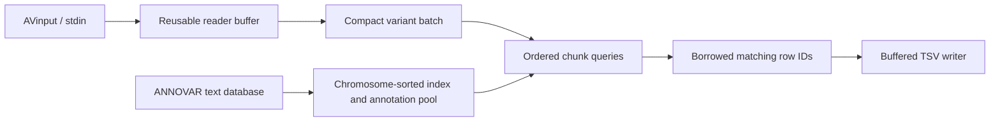

# Architecture

The repository now contains a Rust workspace. The new filter MVP is deliberately separate from the existing `rust-annovar` compatibility frontend; it does not replace the WGS/gene engine or claim its acceptance gates have passed.

| Package | Responsibility |
|---|---|
| Root `rust-annovar` | Existing library, VCF/gene/region/disk-index commands and compatibility adapters |
| `rustannovar-core` | Compact chromosome and allele types, exact-match keys, coordinate validation, borrowed annotation result |
| `rustannovar-vcf` | Input-layer boundary; streaming AVinput reader in this milestone. Native VCF parsing is deferred. |
| `rustannovar-db` | Strict ANNOVAR text ingestion, annotation pool, chromosome-specific sorted vectors |
| `rustannovar-filter` | Binary search and deterministic parallel query chunks |
| `rustannovar-cli` | Experimental `rustannovar` binary, buffered TSV output, CLI and timing report |

Common chromosomes and single-base alleles do not allocate strings. Nonstandard contigs retain exact names after an optional `chr` prefix; `M`, `MT`, `chrM` and `chrMT` share the MT key. Numeric names with leading zeroes remain distinct. Alleles are case-normalized for matching; original input fields are retained for output. Coordinates remain `u64`, avoiding a new maximum-contig-length restriction.

Coordinates use zero-based half-open intervals. An AVinput substitution/deletion `Start..End` becomes `[Start-1, End)`. An insertion `Start=End, REF=-` becomes the interbase site `[Start, Start)`. Reference allele `0` retains an unknown-reference deletion span and only matches an identical key. The MVP does not left-align or split multi-ALT input. It rejects unsupported alleles explicitly.

Database construction parses once, sorts per chromosome, groups identical keys and stores annotation-pool row IDs in original source order. Query cost is logarithmic in the chromosome's unique-key count. Querying does not construct string keys, clone annotation values or create a per-batch database hash map. Result rows borrow matching IDs until the database is dropped. The pool currently stores each source annotation row once; it does not intern equal text across different rows.

Parallel work uses 4,096-record chunks with ordered collection. Small batches and one-thread requests run directly without worker scheduling. There is no global output sort and no thread pool per batch. Formatting happens only in the writer. Valid, unquoted TSV coordinate/extra slices are copied directly to the output buffer; whitespace input and quoted fields take the escaped-field path.

Default batches contain at most 100,000 input records, with an additional approximate 64 MiB retained-input budget. The batch may cross this byte threshold by one accepted record; a single record estimated above it is rejected. The parser buffer, database/index construction, result vector and allocator overhead are outside that budget. In-memory database ingestion and sorting remain the principal database-size limit. This is not an mmap or externally sorted WGS index.

Malformed records fail with path/line context. Extra input columns are preserved as `Otherinfo1...` and must have consistent width. Database rows must match one fixed annotation schema. Metadata lines begin with `##`; one optional `#` column header precedes data. Duplicate hits are joined by semicolons in source order, preserving multiplicity. A five-column database emits `match=1` for hits. Missing values are configurable.

File output is written to a temporary sibling and published only after success. Input/output path aliases are rejected. TSV and report files are individually atomic, not a multi-file transaction; stdout cannot be rolled back. Annotation never requires network access.

This milestone stops at the filter MVP. Native VCF, mmap/RADB, on-disk large-database querying, merge join, specialized database schemas and integration into the compatibility frontend remain future work. Existing gene annotation is maintained without adding new biological features in this change.
