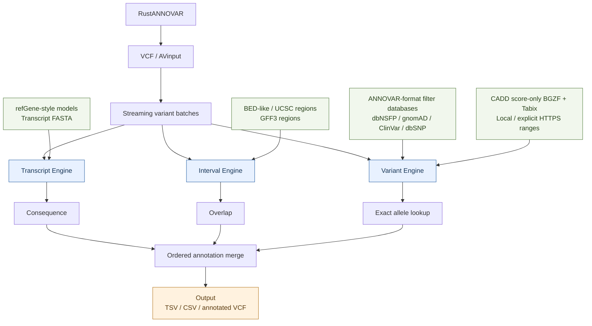

# RustAnnovar

**Current source version: `0.2.0-beta.2` (open beta).** The `main` branch includes the streaming WGS candidate and the isolated experimental **filter MVP** named `rustannovar`. The two executables have different scopes. See [architecture](ARCHITECTURE.md), [measured filter performance](PERFORMANCE.md), and [WGS acceptance status](docs/WGS_ENGINE.md). Versioned package links below refer to previously published artifacts; this source update does not certify WGS compatibility or publish new registry packages.

[](https://github.com/ydlongtao/RustAnnovar/actions/workflows/ci.yml)
[](https://rubygems.org/gems/rust-annovar)
[](https://github.com/ydlongtao/RustAnnovar/issues)
[](https://www.rust-lang.org/)
[](LICENSE-MIT)

**English** | [简体中文](README.zh-CN.md)

[Install via RubyGems](https://rubygems.org/gems/rust-annovar) · [GitHub Packages](https://github.com/users/ydlongtao/packages/rubygems/package/rust-annovar) · [Download beta gem](https://rubygems.org/gems/rust-annovar-0.1.0.beta.1.gem) · [GitHub Releases](https://github.com/ydlongtao/RustAnnovar/releases)

**A variant annotation engine written in Rust, with support for ANNOVAR database formats.**

RustAnnovar provides a native command-line interface and Rust library for annotating genomic variants. It reads supported existing `humandb` files and combines three core operations: exact allele matching, genomic interval overlap, and transcript consequence calculation. Development prioritizes human hg19/hg38 workflows.

## Software architecture

The current `rust-annovar` frontend connects three annotation engines through streaming batches and ordered output.



Transcript annotation currently reads refGene-style models and transcript FASTA. Direct GFF/GTF transcript ingestion is planned; current GFF3 support is for region overlap. Named filter databases must be supplied in compatible ANNOVAR text format; version-specific certification remains pending. The separate experimental `rustannovar` MVP implements only the Variant Engine path for plain AVinput and in-memory filter databases. See [ARCHITECTURE.md](ARCHITECTURE.md) for implementation details and limitations.

## Important statements

> [!WARNING]
> **RustAnnovar is currently in open beta.** It is intended for evaluation, compatibility testing, and research workflow development. It is not yet a complete replacement for ANNOVAR or a clinically validated tool. Validate results with established tools before relying on them for consequential decisions.

- **Compatibility is a goal, not a guarantee.** Selected SNV consequences, generic filter matches, and GFF3 overlap results have been checked against a local ANNOVAR baseline. Complex indels, complete HGVS notation, ncRNA classification, transcript ordering, and specialized database protocols remain incomplete.
- **Independent implementation.** RustAnnovar is not affiliated with or endorsed by ANNOVAR. The annotation engine does not invoke Perl.
- **Bring your own databases.** ANNOVAR scripts and registered databases are not distributed here. Obtain databases separately and comply with their licenses. The bundled demonstration data are entirely synthetic.
- **Performance results have a limited scope.** The measurements below describe specific local workloads; they do not establish equivalent results or a universal speedup on real WES/WGS datasets.

## Features

- Score SNVs with official CADD RawScore/PHRED using native local Tabix or explicit HTTP-range queries; see [CADD integration status and usage](docs/CADD.md).

- Read VCF, gzip-compressed VCF, and AVinput; split multiallelic VCF records.
- Match variants by chromosome, coordinates, reference allele, and alternate allele.
- Query supported BED-style, UCSC-style, and GFF3 region files.
- Read refGene-style transcript models and calculate coding SNV consequences with transcript FASTA.
- Combine databases into TSV or CSV output, or add annotations to VCF INFO while preserving sample columns.
- Build optional 1 Mb block indexes for plain-text filter databases.
- Annotate input rows in parallel while retaining input order.
- Extract reference sequences and select TSV rows by exact field value.

## Experimental sorted-filter MVP

Build the workspace with stable Rust:

```bash
cargo build --workspace --release --locked
./target/release/rustannovar annotate \
  --input crates/rustannovar-cli/tests/fixtures/exact.avinput \
  --database crates/rustannovar-cli/tests/fixtures/exact-db.txt \
  --output result.tsv --threads 4 --batch-size 100000 \
  --report-json timing.json
```

Alternatively, install this experimental executable with `cargo install --path crates/rustannovar-cli --locked`. RubyGems currently installs the existing `rust-annovar` executable, not this new entry point.

The MVP reads plain AVinput and plain ANNOVAR filter text, matches chromosome/start/end/REF/ALT, preserves input order and extra columns, and writes TSV. Use `--input -` for stdin, `--output -` for stdout, `--nastring NA` to change missing values, and `--quiet` to suppress the completion message. The default is one thread; batches default to 100,000 records with an approximate 64 MiB retained-input limit adjustable with `--batch-bytes`.

SNVs, MNVs, simple insertions/deletions and mitochondrial chromosome aliases are tested. Strict validation rejects malformed coordinates, symbolic/multiple ALT values and inconsistent column widths. Query and database alleles must already use compatible AVinput representations. RefSeq, VCF conversion, region annotation and existing disk indexes remain available through `rust-annovar`; they are not part of this new MVP. Real ClinVar/dbSNP release certification, gnomAD/dbNSFP-specific adaptation, VCF, mmap and RADB are not claimed here.

The new lookup path is measured separately from previous WGS experiments. See [PERFORMANCE.md](PERFORMANCE.md) for repeat counts, output comparisons, memory measurements and limitations.

## Runtime comparison

Local measurements used an **Apple M1 (8 cores), macOS 26.5, Perl 5.34.1**, the same hg19 refGene database and transcript FASTA, and an optimized Rust release build. Each workload was warmed up before collecting the median wall-clock time over five or seven runs. Timings include process startup, database loading, annotation, and output writing.

| Workload | Original ANNOVAR (Perl) | Rust implementation | Speedup |
|---|---:|---:|---:|
| 13 SNVs from the bundled ANNOVAR example | 2.40 s | 0.29 s | **8.28×** |
| 26,000 SNV rows, default settings | 4.68 s | 0.37 s | **12.65×** |
| 26,000 SNV rows, single thread | 4.70 s | 0.47 s | **10.00×** |
| 21 variants against 25,688 GFF3 regions | 0.14 s | 0.01 s | **Approximately 14×** |

A separate memory measurement on the 26,000-row workload reported maximum resident memory of **400 MiB for Perl** and **360.3 MiB for Rust**, approximately 9.9% lower.

**How to interpret these numbers:**

- The 26,000-row input repeats 13 SNVs 2,000 times. It is a repeated-record workload, not 26,000 independent variants or a representative WES sample.
- The checked functional and coding SNV fields agree in this example, allowing transcript-order differences. Complete output equivalence has not been established: some UTR/splice `GeneDetail` fields differ.
- GFF3 hit contents agree in the example, but Perl emits only hits and Rust emits all input rows. The short runtime and 0.01-second timer resolution make the ratio approximate.
- A separate 50,000-position synthetic test exposed classification and gene-field differences. Its speedup must not be presented as an equivalent-output benchmark.
- These are historical measurements from the initial implementation, not a benchmark automatically rerun for every commit. See the [detailed benchmark report (Chinese)](docs/BENCHMARK_2026-09-14.md) for environment and compatibility findings.

## Installation

### Requirements

Use the **current stable Rust toolchain** and a native C compiler/linker when building from source. Public CI checks Linux and macOS. A Windows release build workflow is also configured; check release assets for actually available binaries.

Perl is not required to run RustAnnovar. Real annotation requires your own matching database files; the quick-start example does not.

### Option 1: Install from GitHub

If Rust is not installed, install its toolchain using rustup on Linux/macOS:

```bash
curl --proto '=https' --tlsv1.2 -sSf https://sh.rustup.rs | sh
source "$HOME/.cargo/env"
```

Install the current repository version:

```bash
cargo install --git https://github.com/ydlongtao/RustAnnovar.git --locked
rust-annovar --version
```

For a fixed open-beta version, add `--tag v0.1.0-beta.1`. Cargo installs the executable in `~/.cargo/bin`; ensure that directory is in your `PATH`.

### Option 2: Build from source

```bash
git clone https://github.com/ydlongtao/RustAnnovar.git
cd RustAnnovar
cargo build --release --locked
./target/release/rust-annovar --version

# Optional: install the local checkout into ~/.cargo/bin
cargo install --path . --locked
```

### Option 3: Install from RubyGems

[RubyGems package page](https://rubygems.org/gems/rust-annovar) · [Version 0.1.0.beta.1](https://rubygems.org/gems/rust-annovar/versions/0.1.0.beta.1) · [Direct .gem download](https://rubygems.org/gems/rust-annovar-0.1.0.beta.1.gem)

The RubyGems package contains the Rust source and compiles the executable during installation. It therefore requires Cargo and a native linker; Ruby is used only for packaging and launching the compiled binary.

```bash
gem install rust-annovar --pre
rust-annovar --version
```

Version `0.1.0.beta.1` is a prerelease, so `--pre` is required until a stable version is published. The gem version uses RubyGems notation (`0.1.0.beta.1`), while the executable reports the Cargo version (`0.1.0-beta.1`).

To install this exact beta release:

```bash
gem install rust-annovar --version 0.1.0.beta.1 --pre
```

Alternatively, download the `.gem` file using the link above, then run:

```bash
gem install ./rust-annovar-0.1.0.beta.1.gem
rust-annovar --help
```

The downloaded gem still needs Cargo and a native linker to build; Cargo may fetch Rust dependencies during installation. The package does not include ANNOVAR databases. Follow the quick start below for the bundled synthetic example, or supply your own compatible databases.

### GitHub Packages hosting

The gem is publicly hosted on [GitHub Packages](https://github.com/users/ydlongtao/packages/rubygems/package/rust-annovar) and linked to this repository. The repository provides a [GitHub Packages publishing workflow](https://github.com/ydlongtao/RustAnnovar/actions/workflows/packages.yml). It builds and tests the source gem, publishes it on new `v*` tags or manual dispatch, and checks registry downloads. The registry endpoint is `https://rubygems.pkg.github.com/ydlongtao`.

RubyGems.org remains the simplest public installation channel. GitHub Packages requires authentication even for public gems: use a GitHub personal access token (classic) with `read:packages` and access to the package. Follow [GitHub's RubyGems authentication instructions](https://docs.github.com/en/packages/working-with-a-github-packages-registry/working-with-the-rubygems-registry#authenticating-to-github-packages), then install from the configured registry:

```bash
gem install rust-annovar --version 0.1.0.beta.1 --pre --source https://rubygems.pkg.github.com/ydlongtao
```

This source gem has the same Rust/Cargo build requirements described above. GitHub Packages and RubyGems.org are separate registries; the workflow publishes only to GitHub Packages. Republishing an existing version may be rejected; bump the version for a new release.

### Option 4: Download a release binary

Visit [Releases](https://github.com/ydlongtao/RustAnnovar/releases) and choose an asset matching your operating system and processor. The initial `v0.1.0-beta.1` release includes an Apple Silicon macOS archive and `SHA256SUMS`. Other platforms can build from source if no matching asset is available.

After downloading both files to the same directory on macOS:

```bash
shasum -a 256 -c SHA256SUMS
tar -xzf RustAnnovar-v0.1.0-beta.1-aarch64-apple-darwin.tar.gz
./RustAnnovar-v0.1.0-beta.1-aarch64-apple-darwin/rust-annovar --version
```

## Quick start

Clone the repository if you installed only the executable; example files are located in the source checkout. Run the following from the repository root after installing `rust-annovar`:

```bash
rust-annovar table examples/demo.vcf examples/humandb \
  --build hg38 \
  --protocol demo \
  --operation f \
  --vcf-input \
  --output demo.multianno.tsv \
  --vcf-output demo.annotated.vcf

cat demo.multianno.tsv
```

If you built without installing, replace `rust-annovar` with `./target/release/rust-annovar` in all commands.

Expected table:

```text
Chr  Start  End  Ref  Alt  CLNSIG.demo  SOURCE.demo
1    10     10   A    C    Pathogenic   Synthetic_demo
1    25     25   G    A    .            .
```

The actual file is tab-delimited. `Pathogenic` is a fabricated demonstration label, not a clinical assertion about this position. The second record has no database match. The annotated VCF retains the original sample genotype columns.

## Usage guide

### 1. Prepare matching databases

For `table`, files are resolved as `<database-directory>/<build>_<protocol>.txt`. Gene annotation also looks for `<build>_<protocol>Mrna.fa`.

```text
humandb/
├── hg38_refGene.txt
├── hg38_refGeneMrna.fa
├── hg38_cytoBand.txt
└── hg38_clinvar.txt
```

Use the same genome assembly for inputs and databases. `--build` selects filenames; it does not perform liftover or verify assembly identity. Substitute the actual protocol names installed on your machine, including version suffixes. The example filenames do not imply that every database release or specialized schema has been validated.

Gene annotation expects a **transcript FASTA** with matching transcript identifiers. The `sequence` command instead takes a **genomic reference FASTA**. Without transcript sequences, coding consequences may be unavailable.

### 2. Convert VCF to AVinput

```bash
rust-annovar convert sample.vcf.gz \
  --include-info \
  --output sample.avinput
```

Conversion splits alternate alleles and removes common VCF indel anchor bases. It does not establish full reference-aware normalization compatibility across databases.

AVinput uses five required fields: `Chr Start End Ref Alt`, followed by optional extra columns. Substitution/deletion coordinates are one-based and inclusive. Insertions use `-` as the reference allele and an insertion anchor coordinate. Internally, RustAnnovar uses zero-based, half-open intervals with separate insertion handling.

### 3. Annotate one database

**Filter annotation** matches the complete variant key:

```bash
rust-annovar annotate sample.avinput humandb/hg38_clinvar.txt \
  --operation filter --protocol clinvar \
  --output sample.clinvar.tsv
```

Generic filter files use `Chr`, `Start`, `End`, `Ref`, `Alt`, then annotation columns. Query and database alleles must use compatible representations.

**Region annotation** reports interval overlaps:

```bash
rust-annovar annotate sample.avinput humandb/hg38_cytoBand.txt \
  --operation region --protocol cytoBand \
  --output sample.cytoband.tsv
```

BED-style regions use zero-based, half-open coordinates; GFF3 uses one-based, inclusive coordinates. GFF3 support here is for region overlap, not GFF3 transcript-model ingestion.

**Gene annotation** reads refGene-style models:

```bash
rust-annovar annotate sample.avinput humandb/hg38_refGene.txt \
  --operation gene --protocol refGene \
  --fasta humandb/hg38_refGeneMrna.fa \
  --output sample.refgene.tsv
```

The main columns are `Func.refGene`, `Gene.refGene`, `GeneDetail.refGene`, `ExonicFunc.refGene`, and `AAChange.refGene`. Add `--vcf-input` when passing a VCF directly to `annotate`.

### 4. Combine gene, region, and filter annotations

```bash
rust-annovar table sample.vcf humandb \
  --build hg38 \
  --protocol refGene,cytoBand,clinvar \
  --operation g,r,f \
  --vcf-input \
  --output sample.hg38_multianno.tsv \
  --vcf-output sample.hg38_multianno.vcf
```

Protocols and operations must correspond one-to-one. `g`, `r`, and `f` mean gene, region, and filter. Database columns follow the requested protocol order. Missing values default to `.` and can be changed with `--nastring`.

Use `--csv` for CSV table output. Use `--vcf-output` together with `--vcf-input` for an annotated VCF. Added INFO fields use `FA_<protocol>` identifiers; this schema differs from original ANNOVAR VCF output. Original sample and FORMAT columns are retained.

### 5. Manage filter database indexes

```bash
rust-annovar db index humandb/hg38_dbnsfp.txt --kind filter
rust-annovar db check humandb/hg38_dbnsfp.fai.json
rust-annovar db list humandb --build hg38
```

The default sidecar records 1 Mb block byte ranges and source metadata. Queries can load relevant ranges from plain-text filter files. Missing or detected-stale indexes and gzip files fall back to full loading. Rebuild indexes after changing or relocating a database. Source checks use size, modification time, and a prefix hash, not a full-file integrity check.

`db download <URL> <OUTPUT> --sha256 <EXPECTED_SHA256>` downloads a file from a supplied public URL and optionally validates its full checksum. It does not implement the registered ANNOVAR download catalog.

### 6. Extract sequences and filter tables

```bash
rust-annovar sequence regions.avinput reference.fa --output regions.fa

rust-annovar reduce sample.hg38_multianno.tsv \
  --column Func.refGene --equals exonic \
  --output sample.exonic.tsv
```

Sequence extraction currently loads the reference FASTA into memory. `reduce` accepts a tab-delimited table and performs exact string equality; it is not a numeric threshold or expression engine.

`coding-change` is a convenience entry point for gene annotation with the same arguments as `annotate`. It is not a complete replacement for the original `coding_change.pl` protein FASTA workflow.

### 7. Control parallelism

```bash
RAYON_NUM_THREADS=1 rust-annovar table sample.avinput humandb \
  --build hg38 --protocol refGene --operation g \
  --output sample.single-thread.tsv
```

Set `RAYON_NUM_THREADS` to the desired worker count. Without it, Rayon selects the thread pool size automatically. Input and result tables are currently held in memory, so large WGS workloads still require memory planning and validation.

## Command reference

| Command | Purpose |
|---|---|
| `convert` | Convert VCF or gzip VCF to AVinput |
| `annotate` | Annotate with one gene, region, or filter database |
| `table` | Combine databases into TSV, CSV, and optionally VCF |
| `db index/check/list/download` | Manage local database metadata and downloads |
| `sequence` | Extract genomic FASTA intervals |
| `coding-change` | Run gene consequence annotation |
| `reduce` | Select TSV rows by exact column value |

Run `rust-annovar --help` or `rust-annovar <command> --help` for available options.

## Validation and feedback

Run public checks from the source directory:

```bash
cargo fmt -- --check
cargo clippy --all-targets --all-features -- -D warnings
cargo test --all-features
```

Optional compatibility tests require the registered installation at **`annovar/` in the repository root**, including its bundled example and hg19 databases:

```bash
cargo test --test annovar_compat -- --ignored
```

These tests check selected fields against saved Perl outputs and expected example hits; they do not validate every ANNOVAR feature. To regenerate the saved baseline, use `ANNOVAR_HOME=/path/to/annovar scripts/capture_perl_baseline.sh`. The test loader itself does not read `ANNOVAR_HOME`.

See [compatibility status (Chinese)](docs/COMPATIBILITY.md). Report reproducible differences through [GitHub Issues](https://github.com/ydlongtao/RustAnnovar/issues), including the software version, genome build, database version, commands, a minimal input, and expected versus observed output. Do not include restricted databases, credentials, or identifiable genomic data.

## License and acknowledgments

The project source is offered under [MIT](LICENSE-MIT) or [Apache-2.0](LICENSE-APACHE), at your option. This does not extend to third-party databases or ANNOVAR software.

Repository presentation was inspired by [Huang-lab/fastVEP](https://github.com/Huang-lab/fastVEP). We acknowledge the ANNOVAR authors and the variant annotation community for the formats and resources underlying compatibility evaluation.
